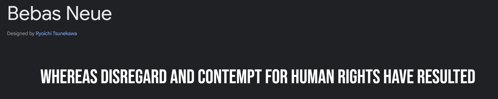
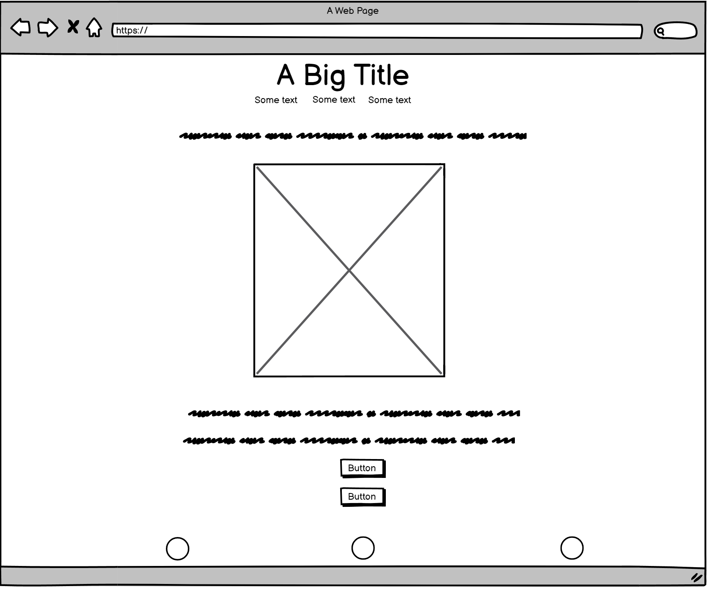
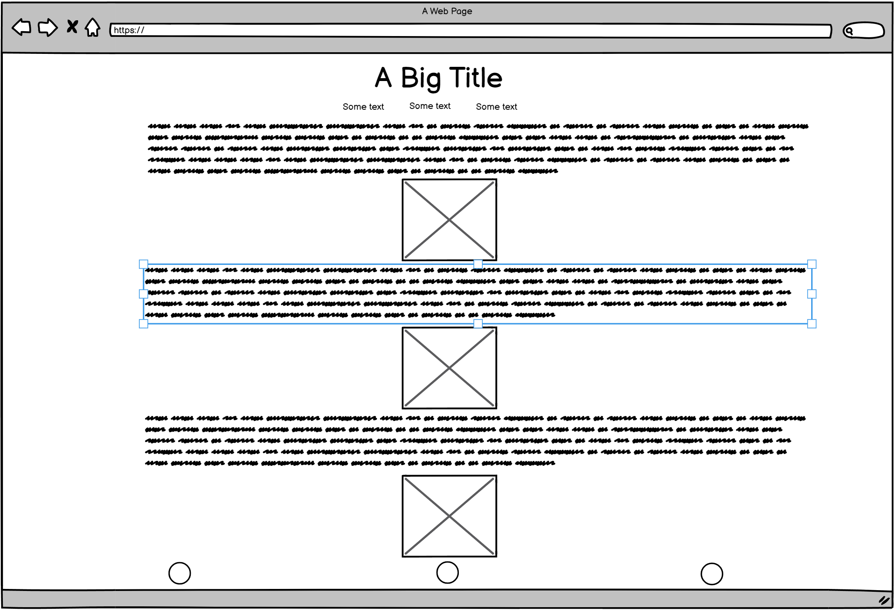
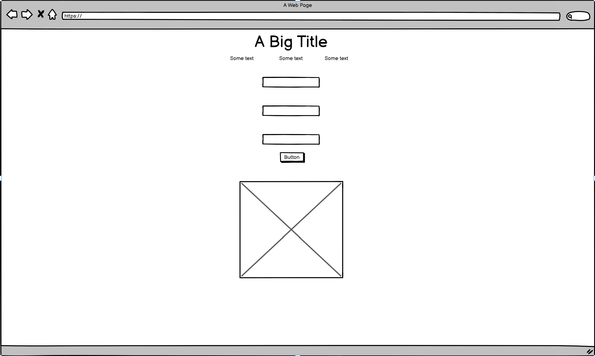
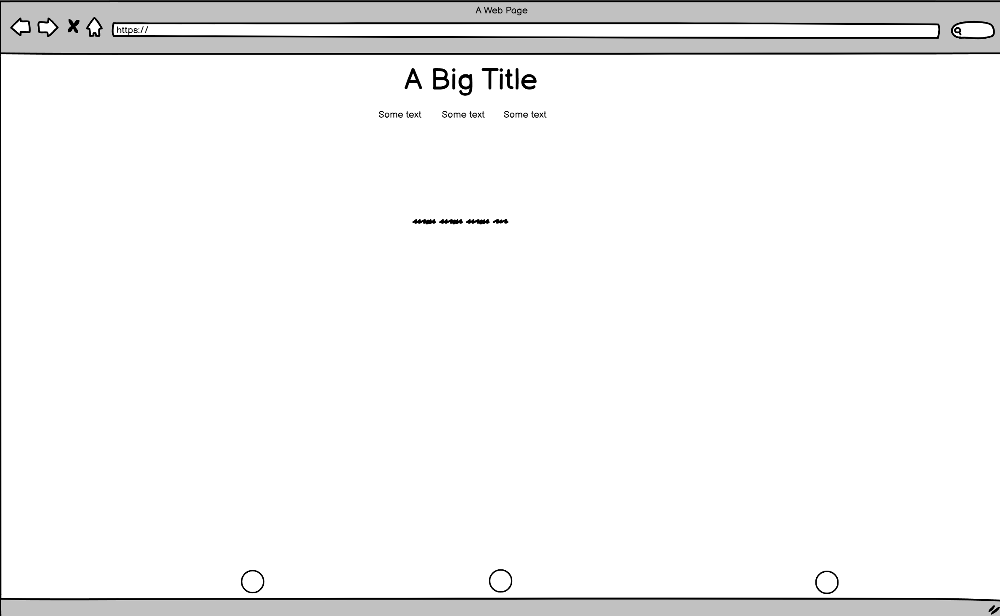
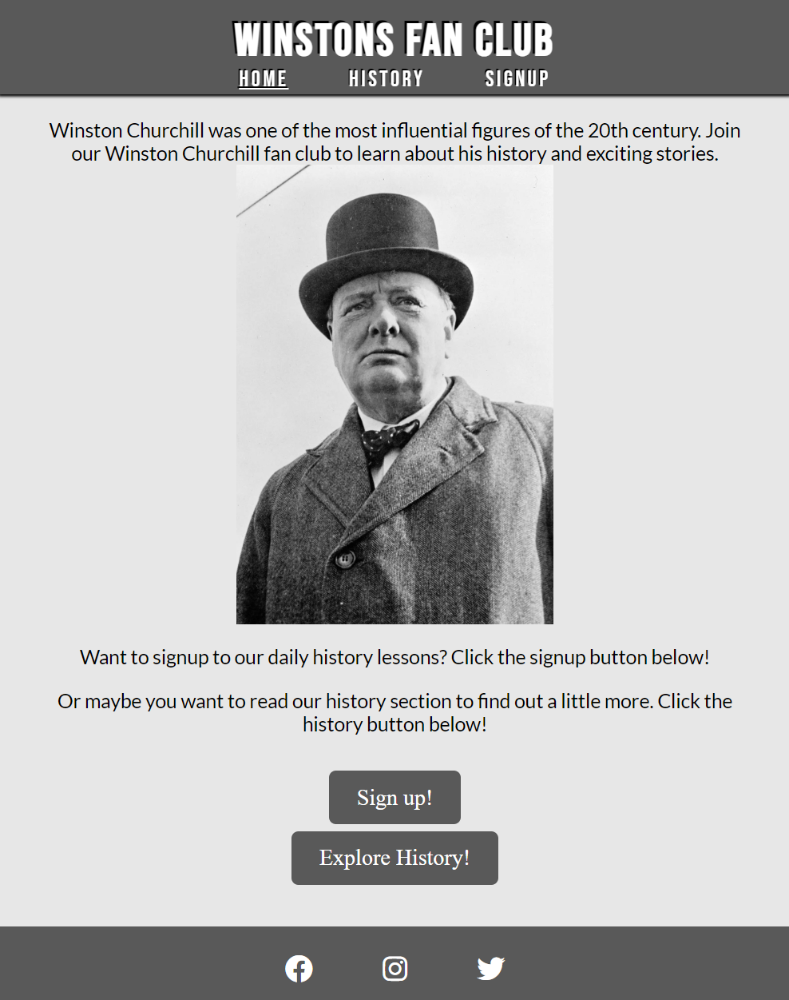
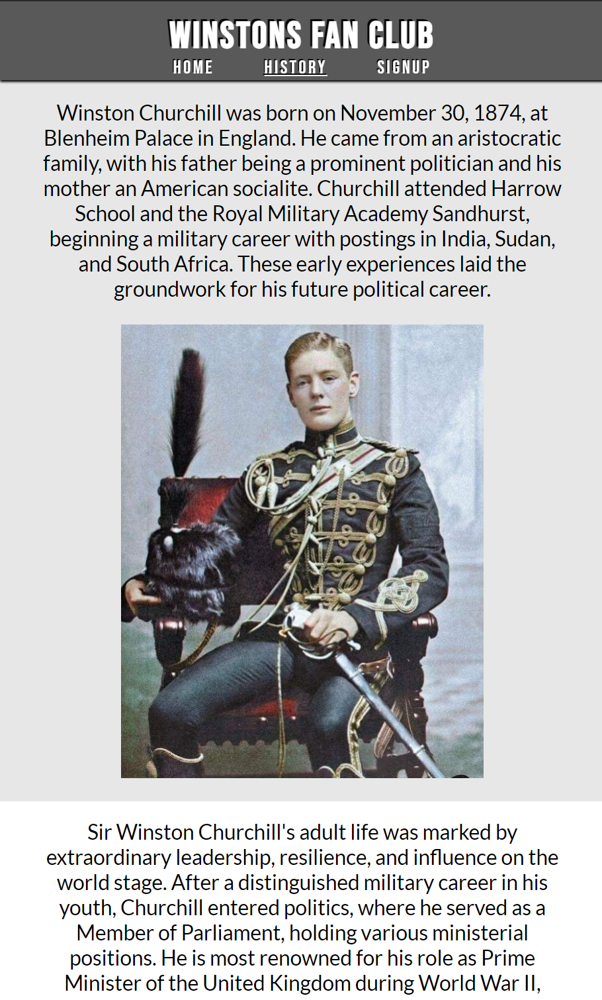
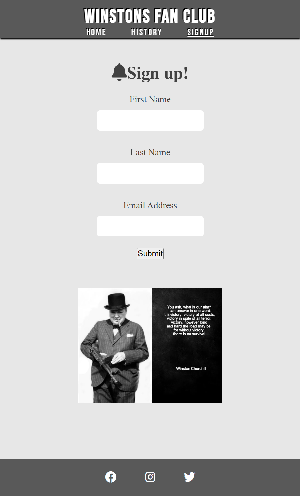
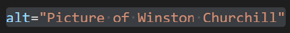
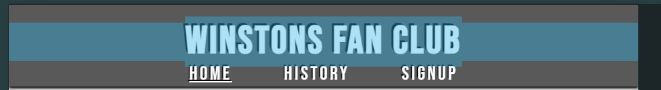

# Winstons Fan Club

Visit the deployed site: [Winstons Fan Club](https://ashley9368.github.io/Winstons-Fanclub-Project-1/)

Test your history knowledge about Winston Churchill?

Our Winston Churchill history page offers a unique and comprehensive exploration of his life and legacy. By signing up, you'll gain exclusive access to a wealth of resources, including detailed biographies, rare photographs, and insightful articles.

Whether you're a student, history enthusiast, or researcher, our platform provides the tools you need to delve deep into Churchill's enduring influence on global history. Join our community to connect with fellow history fans, participate in engaging discussions, and enhance your understanding of one of history's greatest leaders.

## CONTENTS

* [User Experience](#user-experience-ux)

* [Design](#design)
  * [Colour Scheme](#colour-scheme)
  * [Typography](#typography)
  * [Imagery](#imagery)
  * [Wireframes](#wireframes)
  * [Features](#features)
    * [The Home Page](#the-home-page)
    * [Future Implementations](#future-implementations)
  * [Accessibility](#accessibility)

  * [Languages Used](#languages-used)
  * [Frameworks, Libraries & Programs Used](#frameworks-libraries--programs-used)

* [Deployment & Local Development](#deployment--local-development)
  * [Deployment](#deployment)
  * [Local Development](#local-development)
    * [How to Fork](#how-to-fork)
    * [How to Clone](#how-to-clone)

* [Testing](#testing)
  * [Solved Bugs](#solved-bugs)
  * [Known Bugs](#known-bugs)
  
* [Credits](#credits)
  * [Code Used](#code-used)
  * [Content](#content)
  * [Media](#media)
  * [Acknowledgments](#acknowledgments)

## User Experience (UX)

#### First Time Visitor Goals

* I want to take part in a history website online and improve my knowledge of Churchill.
* I want the site to be responsive to my device.
* I want the site to be easy to navigate.

#### Returning Visitor Goals

* I want them to be able to look at specific aspects of Churchill’s life and know how to navigate to pages which have things relating to their specific interests.

#### Frequent Visitor Goals

* I want to be able to sign up to become part of Churchills fan club.

## Design

### Colour Scheme

I have gone with the black and white theme to represent photography in World War 2 in which Churchills career had really taken off.

In my css files i have declared the colour codes to be used on my website. 

* I have used `#595959` & `#ffffff` `#rgb(0, 0, 0)` as the primary and secondary colours used for the sites text.
* All other colours are imbeded in various images directly.

  

### Typography

Google Fonts was used to import the chosen fonts for use in the site.

* For the Page Title I have used the google font [bebas-neue](https://fonts.google.com/specimen/Bebas+Neue?preview.text=Winstons%20Fan%20Club&preview.text_type=custom&query=bebas). I chose bebas-neue because it is a clear font that looks clear on all screen sizes.

* For the body of the page I have used the google font [Lato](https://fonts.google.com/specimen/Lato?preview.text=Winstons%20Fan%20Club&preview.text_type=custom&query=lato). i chose lato because again it is easily readable clear and clean.

### Imagery

As this is the Churchill fan club i have used images of churchill a different stages of his life.

### Wireframes

Wireframes were created for desktop using balsamiq.

### Features

The website is comprised of a home page, a history page, and a signup page, and a basic thank you page for those who sign up.

All Pages on the website are responsive and have:

* A favicon in the browser tab.

  

* The title of the site at the top of every page. This title also acts as a link back to the home page.
  

#### The Home Page

The home page of Winstons Fan Club displays the sites name as a title in bold text, navbar imbeded links to sub pages. It also has links to the signup and explore more history.

The history page consists of more information about Winston Churchill at different stages in his life.

The signup page consists of a signup form to signup for daily emails about Churchill and the Club.

 

#### Future Implementations

In future implementations I would like to:

1. I would like to add an interactive timeline, to let visitors explore a more interactive approach to history.
2. I would like to make the home page more welcoming, And add more sub pages regarding specific important events in Churchill's life.
3. I'd like to add a custom cursor when you hover over buttons. 
4. I would like to add a video of one of Churchill's speeches.
5. I would also like a much better thank you page.

### Accessibility

I have included image-to-text to improve accessability for visually impaired visitors.

* All of the fonts used are part of the san serif font family to help those with dyslexia to read more clearly.
* I have used similar colours throughout the site to provide the same experience for colour blind users.

### Languages Used

HTML, CSS

### Frameworks, Libraries & Programs Used

* [Balsamiq](https://balsamiq.com/) - Used to create wireframes.

* [Github](https://github.com/) - To save and store the files for the website.

* [GitPod](https://gitpod.io/) - IDE used to create the site.

* [Google Fonts](https://fonts.google.com/) - To import the fonts used on the website.

* [Google Developer Tools](https://developers.google.com/web/tools) - To troubleshoot and test features, solve issues with responsiveness and styling.

* [Favicon.io](https://favicon.io/) To create favicon.

### Deployment

The site is deployed using GitHub Pages - [Winstons Fan Club](https://ashley9368.github.io/Winstons-Fanclub-Project-1/).

## Testing

### Solved Bugs

| No | Bug | How I solved the issue |
| :--- | :--- | :--- |
| 1 | I had an issue with responsiveness on pages of different devices because i had written the media queries wrong, I have fixed those issue by rewritting various code across all media queries |

### Known Bugs

* Known bug: Title - If you click left or right of the title on any page, it sends the user back to the homepage. I intend to fix this so that only clicking on the actual title text redirects the user to the homepage.

  

## Credits

### Code Used

* I used [Chat GPT](https://openai.com/index/chatgpt/) To help when i was unsure what elements to use, but never copied direct code from Chat GPT, For example, I used ChatGTP to suggest various types of fonts which would be easy to read for people with dyslexia, and if i had got stuck on something i would ask which code i was missing or how can i achieve x.

* I used [Code Institute love running project](https://learn.codeinstitute.net/courses/course-v1:CodeInstitute+LRFX101+4/courseware/e805068059af42af87681032aa64053f/1da6ad13213740f1855a51d30a2375b1/) As refrence at times to adhere to good coding practice, The code that i have copied at any point has be mentioned with a comment in my code.

### Content

Except where mentioned content was created by me, except for images which were found on google, and historical facts that were generated from Chat GPT.

### Media

[Image on home page](https://upload.wikimedia.org/wikipedia/commons/thumb/9/9c/Sir_Winston_S_Churchill.jpg/1200px-Sir_Winston_S_Churchill.jpg)

[Image on history page of young churchill](https://qph.cf2.quoracdn.net/main-qimg-fc196db16dcd9211403a84c827b3fc42-lq)
[Image on history page of adult chuchill](https://archives.chu.cam.ac.uk/wp-content/uploads/sites/2/2022/01/CHUR-1-103tn.jpg)
[Image on history page of later life churchill](https://encrypted-tbn0.gstatic.com/images?q=tbn:ANd9GcT2id3sVkOKr2l33fJwhOqbYXTQFS3vzDS3LQ&s)

[Image on signup page of churchill](https://i.ebayimg.com/images/g/rsQAAOSwIWZh6EhZ/s-l1600.webp) 

### Acknowledgments

I would like to acknowledge the following people:

* Jubril Akolade - My Code Institute Mentor.

* Kristen Cross - Another fellow on slack who has been a great help aligning me at times when ive been confused.

* The code instutue tutor team, (Not all but to name afew) Roo, Holly, Oisin, Thomas.

* The Code Institute Slack channel Peer Code Review - Thank you to everyone who took the time to play the quiz and look over the code.